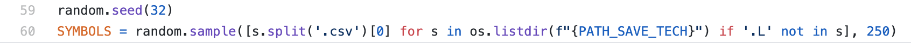
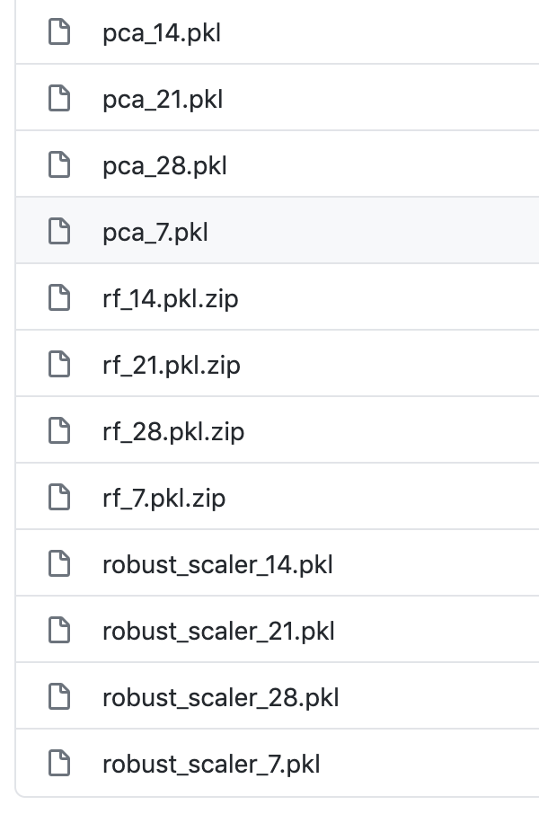
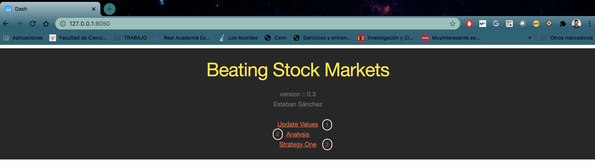
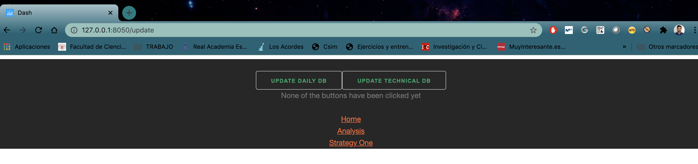
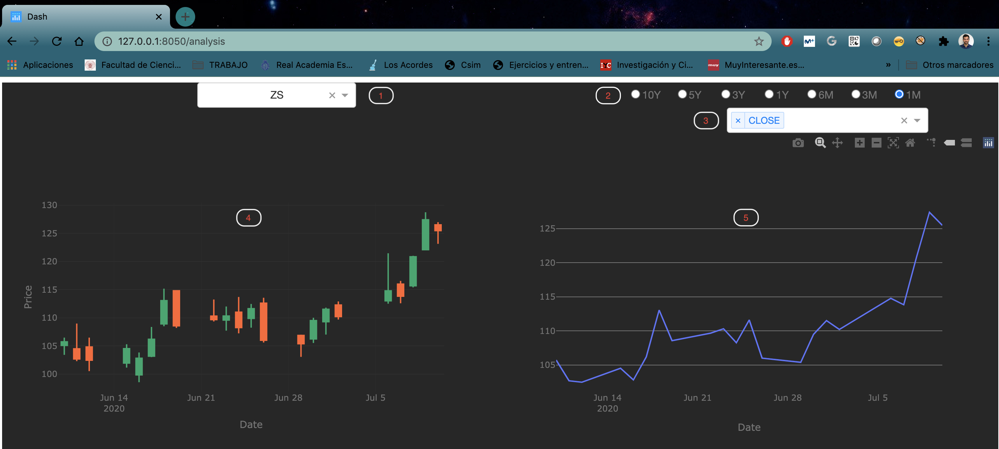
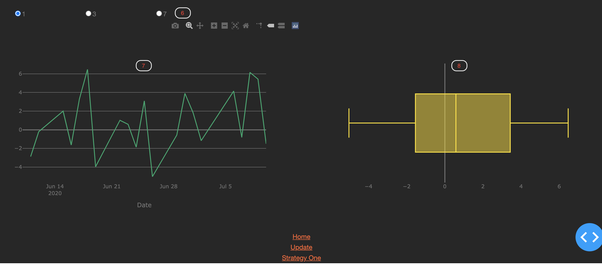

# Beating Stock Market
This repo contains an actual version of the master disertation beating_stock_market.

All codes are documented in spanish following numpy style guide.

You can see what to expect from this project reading in this medium post [Machine Learning, Fintech & Trading | by: Esteban Sánchez | Medium](https://medium.com/)

## Before starting
First of all you will need a free or premium API key from [Alpha Vantage](https://www.alphavantage.co/) that you have to write on line 7 of ```constants.py```


You have to decide how many tickers or over which tickers you want to use the app, you can change that on lines 59 and 60 of ```constants.py```



Last thing you have to do before to start using it is to unzip the zip files inside ```./data/model```
typing ```unzip file_2_unzip.zip```



## Run the app
To run the app you have to activate the environment and then type:

```python index.py```

## Views

### Home



Numbers in red is to navegate between pages.

### Update Values



This view is to update close price data clicking on the left button or technical indicators clicking on the right button.

This will update tickers in SYMBOLS variable of ```constants.py```

### Analysis



1. Choose a ticker to analyse.
2. Data range to see previous data.
3. Choose technical indicators to analyse.
4. Candlestick chart.
5. Technical indicators chart.
6. Days to deploy the pct_change.
7. Pct_change chart.
8. Box-plot of the distribution of the pct_change
